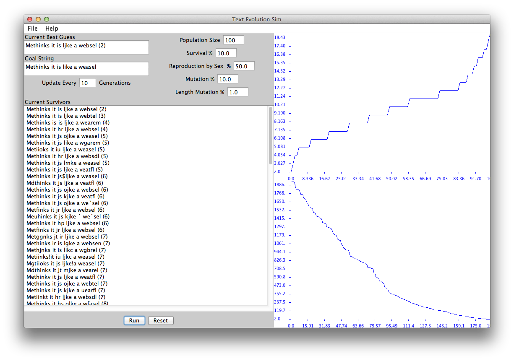

Evolving Text
===============

This code evolves sentences given only a number that rates how good
its guesses are. The idea came from a example [(Wikipedia page)](http://en.wikipedia.org/wiki/Weasel_program) given in "The
Blind Watchmaker" by <a href="http://www.world-of-dawkins.com/">Richard Dawkins</a>. Each letter in the sentence simulates a single gene in an organism
that mutates over time. There are other programs out there that
do the same thing and are listed in the wikipedia page.
Its often called the weasel simulator because the goal string in
the book was "Methinks it is like a weasel".

